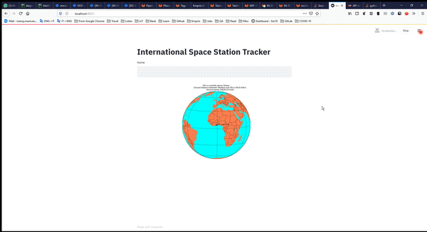

# Live ISS Tracker

A project started as a way to learn how to real world projects are developed and deployed into production.
It also serves as a template for creating a python project, build using docker containers, docker-compose and the use of maven. It also includes gitlab continuous integration.

# Make commands

##  Build and Package
This command will build the docker images defined in the docker-compose.yml file, pushes the application image (python), defined in Dockerfile, to gitlab repository
```
make clean package
```

## Run the project
This command will run the docker-compose.yml and brings the containers (Python app and DB) in the background.
```
make clean launch
```
then go to your web browser at ```localhost:8501``` to view the application

## Help
Check other targets using help ```make help```
```
Main targets: LIVE_ISS_TRACKER
clean                   : Clean mvn target folder
stop                    : Stop all containers and bring down docker-compose if up
dk_compose_tests        : Launch the application successfully in docker-compose mode
run_python_tests        : Run python package test. SKIP_REMOVE_CONTAINER=true to skip removing the docker container if tests pass.
run_streamlit           : Runs the Streamlit server on the container.
package                 : Builds docker images and pushes to GITLAB registry
deep_clean              : Cleans mvn target folder, removes docker volumes, containers and images matching 'liveisstracker'
launch                  : Generates resources and brings the docker-compose up 'builds images'
help                    : show this help
```

## Environment setup

### Installation on windows

#### For Maven and Java

Steps followed to install java and maven on a windows machine

1. Download binary zip archive for Maven from [here](https://maven.apache.org/download.cgi)
2. Download Windows compressed archive for Java from [here](https://www.oracle.com/java/technologies/javase-jdk14-downloads.html)
3. Extract both in ```C:\dev\tools``` in their own folders
4. Add system variables
    1. ```JAVA_HOME``` pointing to folder ```C:\dev\tools\jdk-folder```
    2. ```MAVEN_HOME``` pointing to folder ```C:\dev\tools\maven-folder```
5. Edit system variable 'PATH'. Add two new entries ```%JAVA_HOME%\bin``` and ```%MAVEN_HOME%\bin```

verify java by opening new command prompt and typing ```java --version``` and ```mvn --version``` for maven

#### For Docker

Install docker cli from [here](https://docs.docker.com/toolbox/toolbox_install_windows/)

#### For Make

```make``` is a GNU command so the only way you can get it on Windows is installing a Windows version like the one provided by [GNUWin32](http://gnuwin32.sourceforge.net/packages/make.htm). Or you can install [MinGW](http://www.mingw.org/) and then do: ```copy c:\MinGW\bin\mingw32-make.exe c:\MinGW\bin\make.exe```. Then update the PATH to include the bin directory of the make.exe.

### Installation on Linux

Java and Maven can be setup by installing maven alone, which will pull its java dependency

```sudo apt-get install maven``` for debian/ubuntu

