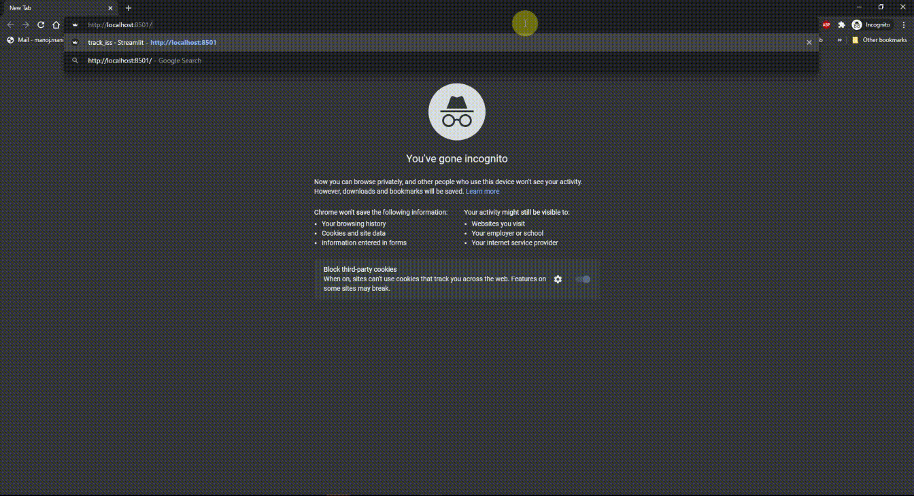

# Live ISS Tracker

🛰️ A simple desktop application and CLI that tracks the real-time location of the International Space Station.



## Quick Start

This application provides two main commands:
*   `run`: Launches the interactive 3D globe in a desktop window.
*   `location`: Prints the current latitude and longitude of the ISS to the console.

To use these commands, make sure you have a modern version of Python and `uv` installed, then simply run:

```bash
# To run the GUI application
uvx --from liveisstracker run

# To get the current location in your terminal
uvx --from liveisstracker location
```

## Other Ways to Run

### Using `pipx`

If you have `pipx` installed, you can use it to run the commands in an isolated environment:

```bash
pipx run --spec liveisstracker run
pipx run --spec liveisstracker location
```

### Using `pip`

You can also install the package directly into your Python environment using `pip`:

```bash
# Install the package
pip install liveisstracker

# Run the commands
liveisstracker run
liveisstracker location
```

## Development

To contribute to the development of this project, you can set it up locally:

1.  **Clone the repository:**
    ```bash
    git clone https://github.com/manojmanivannan/liveisstracker.git
    cd liveisstracker
    ```

2.  **Run the application commands:**
    The included `run.sh` script uses `uv` to install dependencies and run the app in a local virtual environment. You can pass the subcommands to it:
    ```bash
    # Run the GUI
    ./run.sh run

    # Get the location
    ./run.sh location
    ```

---

### Versioning and Releasing

This project includes an interactive script to simplify the process of versioning and creating new releases.

To create a new version, run:

```bash
./version_tag_push
```

This script will guide you through bumping the version number, creating a new Git tag, and pushing the tag to the remote repository. Pushing a new tag will automatically trigger the GitHub Actions workflow to publish the new version to PyPI.
